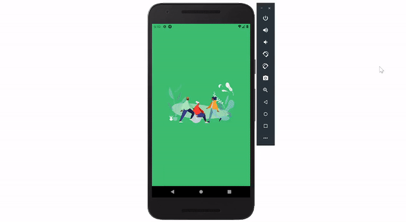

# Delivery App Clone


<br>

<p align="center">
  
</p>

<br>

## Tópicos

[Sobre o Projeto](#sobre-o-projeto)

[Tecnologias](#tecnologias)

[Autor](#autor)

[Creditos de imagem](#creditos-de-imagem)

<br>

## Sobre o Projeto

Simples Aplicativo de Delivery desenvolvido em React Native e TailwindCSS

<br>

## Tecnologias da Aplicação Mobile

Tecnologias e ferramentas utilizadas no desenvolvimento da Mobile:

- [React Native](https://reactnative.dev/)
- [TailWindCSS](https://tailwindcss.com/)
- [Sanity.io](https://www.sanity.io/)
- [Redux](https://redux.js.org/)

<br>

## Instalação

```bash
$ yarn
$ expo start
```

<br>

## Autor

[](https://github.com/savio-2-lopes)
[](https://www.instagram.com/savioaugulopes/)
[](https://www.linkedin.com/in/savio-lopes/)
[](mailto:savio.dev.lopes@gmail.com)

Feito com ❤️ por [Savio Lopes](https://www.linkedin.com/in/savio-lopes/)

<br>

## Creditos de imagem

As imagens que representam os restaurante e pratos foram obtidas do site [pixabay](https://pixabay.com), que armazena imagens gratuitas. Abaixo os créditos aos autores das imagens:

[Silvia](https://pixabay.com/users/silviarita-3142410/?utm_source=link-attribution&utm_medium=referral&utm_campaign=image&utm_content=2756467) from Pixabay

[Bernadette Wurzinger](https://pixabay.com/users/einladung_zum_essen-3625323/?utm_source=link-attribution&utm_medium=referral&utm_campaign=image&utm_content=1804457) from Pixabay

[Stefan](https://pixabay.com/users/divily-110719/?utm_source=link-attribution&utm_medium=referral&utm_campaign=image&utm_content=2931846) from Pixabay

[zuzana gazdikova](https://pixabay.com/users/zuzi99-7340598/?utm_source=link-attribution&utm_medium=referral&utm_campaign=image&utm_content=3010062) from Pixabay

[congerdesign](https://pixabay.com/users/congerdesign-509903/?utm_source=link-attribution&utm_medium=referral&utm_campaign=image&utm_content=2972858) from Pixabay

[Rita-👩‍🍳 und 📷 mit ❤](https://pixabay.com/users/ritae-19628/?utm_source=link-attribution&utm_medium=referral&utm_campaign=image&utm_content=3317060) from Pixabay

[Keram Borz](https://pixabay.com/users/keram-257754/?utm_source=link-attribution&utm_medium=referral&utm_campaign=image&utm_content=346985) from Pixabay

[Aline Ponce](https://pixabay.com/users/ponce_photography-2473530/?utm_source=link-attribution&utm_medium=referral&utm_campaign=image&utm_content=1442946) from Pixabay

[Theo Crazzolara](https://pixabay.com/users/theocrazzolara-10197635/?utm_source=link-attribution&utm_medium=referral&utm_campaign=image&utm_content=4614022) from Pixabay

[einladung_zum_essen](https://pixabay.com/users/einladung_zum_essen-3625323/?utm_source=link-attribution&utm_medium=referral&utm_campaign=image&utm_content=2258013) from Pixabay

[Engin Akyurt](https://pixabay.com/users/engin_akyurt-3656355/?utm_source=link-attribution&utm_medium=referral&utm_campaign=image&utm_content=3497424) from Pixabay
